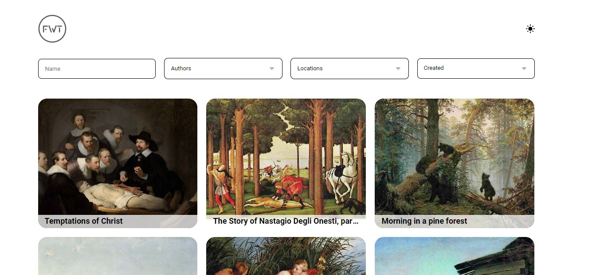
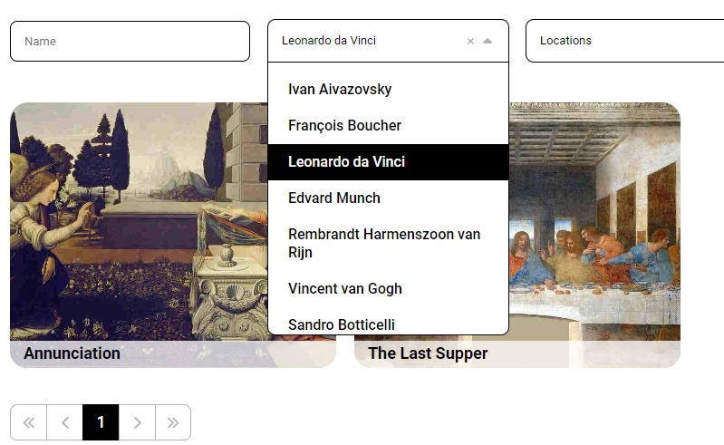
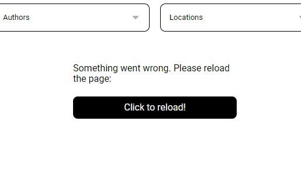
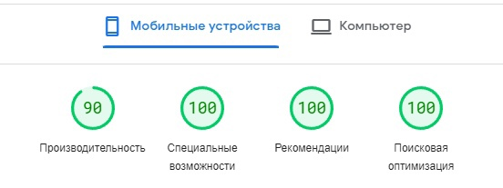
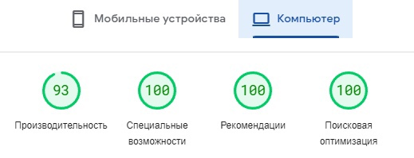

<h1 align="center">Image gallery</h1>

<p align="center">


</p>



<h2 align="center"><a  href="https://nyar1othotep.github.io/fwt-test-task/">Live Demo</a></h2>

## Описание

Сайт для просмотра и поиска картин знаменитых художников. 

<p align="center">

</p>

Сделан сайт по техническому заданию от компании Framework Team.

## Используемые технологии

1. React
2. SCSS

## Используемые библиотеки

1. query-string
2. react-lazy-load-image-component
3. simplebar-react

## Собственные решения

За основу для компонентов Select, Input, Range и Pagination была использована ui библиотека "fwt-internship-uikit". Компоненты были модифицированы, поэтому они в корне отличаются от оригинала.
Найти компонеты можно:

1. **Select: ["src/components/Select"](https://github.com/Nyar1othotep/fwt-test-task/tree/main/src/components/Select)**
2. **Input: ["src/components/Input"](https://github.com/Nyar1othotep/fwt-test-task/tree/main/src/components/Input)**
3. **Range: ["src/components/Range"](https://github.com/Nyar1othotep/fwt-test-task/tree/main/src/components/Range)**
4. **Pagination: ["src/components/Pagination"](https://github.com/Nyar1othotep/fwt-test-task/tree/main/src/components/Pagination)**

Так же, когда происходи какая-либо ошибка, выводится сообщение:

<p align="center">

</p>

## Технические решения

1. Для фильтров используется отдельная функция **["onPaintingsRequest()"](https://github.com/Nyar1othotep/fwt-test-task/blob/main/src/components/Pages/GalleryPage.js#L43)**, чтобы оптимизировать запросы на сервер (Применение фильтра -> один запрос -> получение данных -> вывод данных).
2. Для оптимизации запросов на сервер, данные для фильтров получаются один раз, при загрузке страницы, поэтому вызов функции реализован через "useEffect". **["onRequest()"](https://github.com/Nyar1othotep/fwt-test-task/blob/main/src/components/Pages/GalleryPage.js#L29)**

## Возникшие проблемы

При оптимизации сайта и проверки его на **["PageSpeed Insights"](https://pagespeed.web.dev/analysis/https-nyar1othotep-github-io-fwt-test-task/no95yfcdpk?form_factor=desktop)**, выявлена проблема в виде "Задайте правила эффективного использования кеша для статических объектов". То есть, необходимо повысить **"Время жизни кеша"**.

Однако, данную проблему оказалось не решить, так как сайт загружен на GitHub Pages, поэтому автоматически выставляется **"Cache-Control: max-age=600"**, то есть **"Время жизни кеша"** равняется 10 минутам, что явно мало для проверки сайта на оптимизацию. **["Ответ на эту проблему"](https://webapps.stackexchange.com/questions/119286/caching-assets-in-website-served-from-github-pages)**.

Но даже так, сайт имеет неплохие показатели оптимизации:




## Установка проекта

1. Скачать проект из репозитория.
2. Открыть в редакторе кода терминал.
3.
	```
	npm install
	npm start
	```

## Контакты

1. **[ВКонтакте - Минин Максим](https://vk.com/astra_earth)**
2. **Почта: nyarlothotephoro@gmail.com**